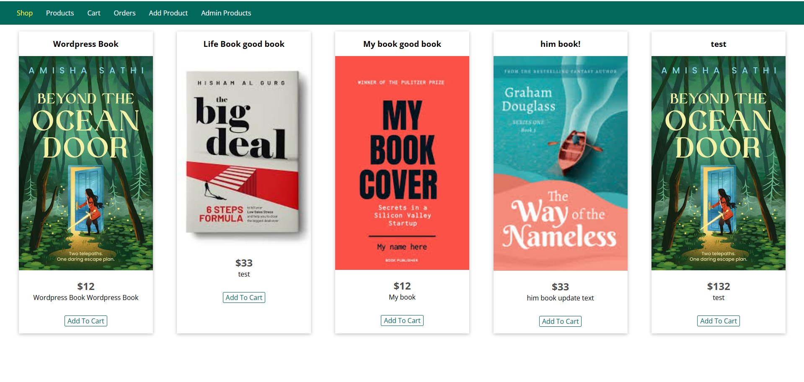
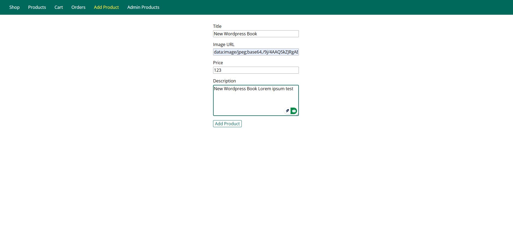
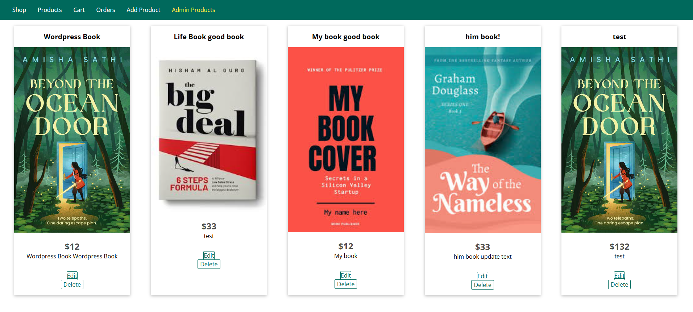
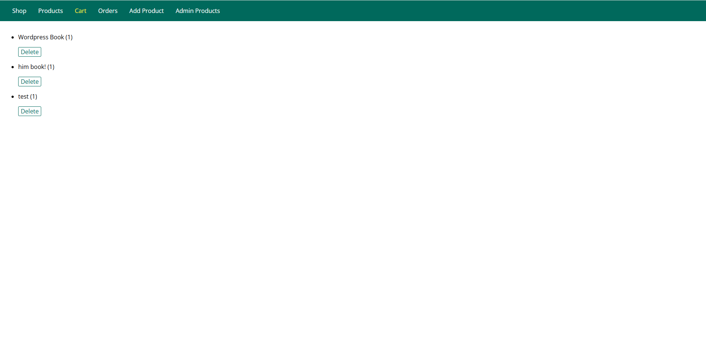

# nodejs-ecommerce-app
<h1>Node.js E-commerce App with JSON File-Based Data Storage</h1>

<h2>Frontend Features</h2>
<ul>
  <li>Products Shop Listing</li>
  <li>Add to Cart</li>
  <li>Delete Cart items</li>
</ul>

<h2>Backend Features (Admin Panel)</h2>
<ul>
  <li>Add Product</li>
  <li>Edit Product</li>
  <li>Delete Product</li>
</ul>

<h1>Product Lists</h1>

<h1>Add Products</h1>

<h1>Admin Product List</h1>

<h1>Simple Cart</h1>

